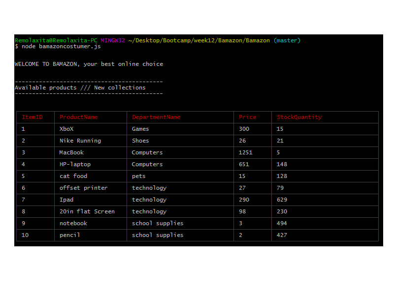
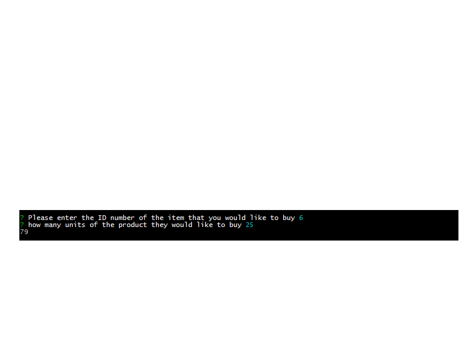
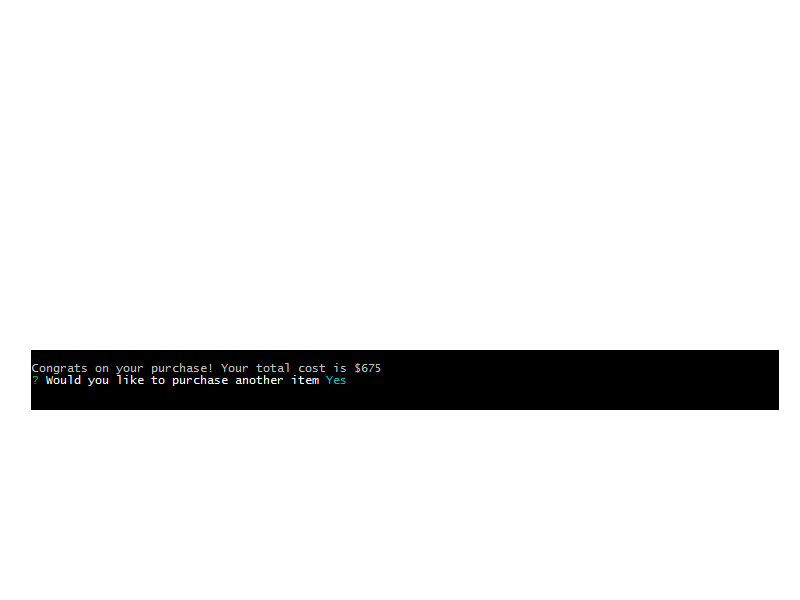
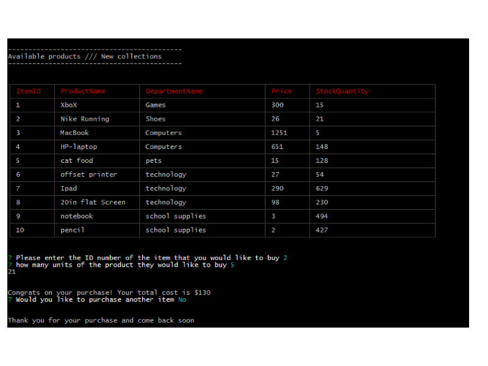

# Bamazon

This image shows the data coming from mySQL and being display in node trhu JS.

the user will enter the id number of the product that they will like to order and the quantity (it will not allow the user to input a value different than a number)

If the quantity that the costumer wants is in stock it will give it the total price of the purchase and the option to do another purchase or to exit the app, also it will update the number of products in stock

